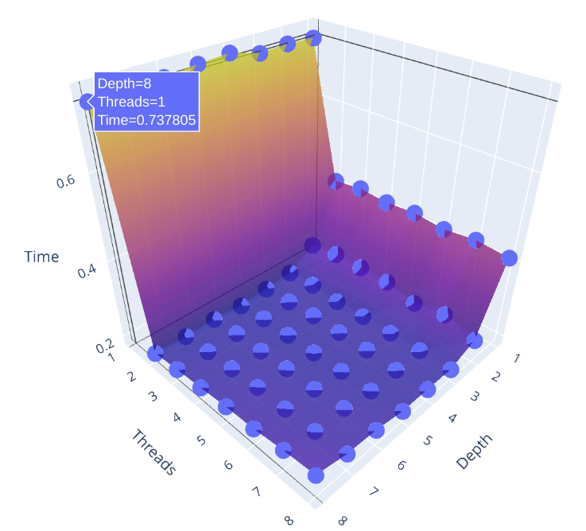
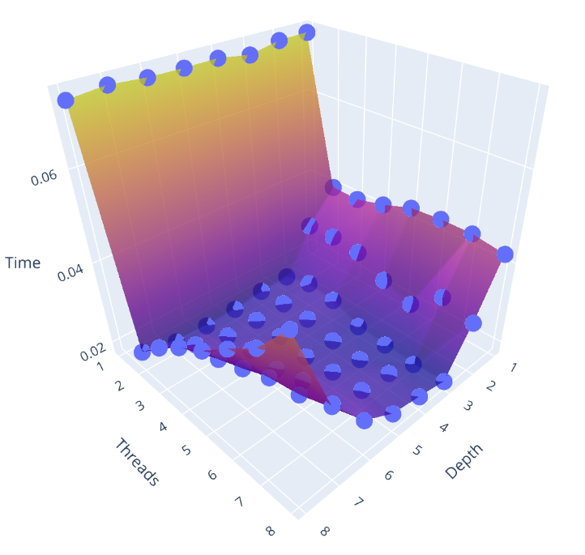
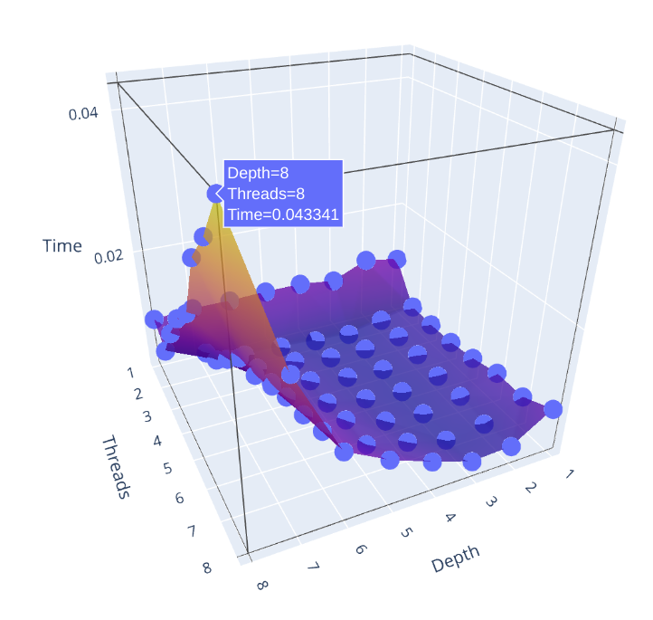
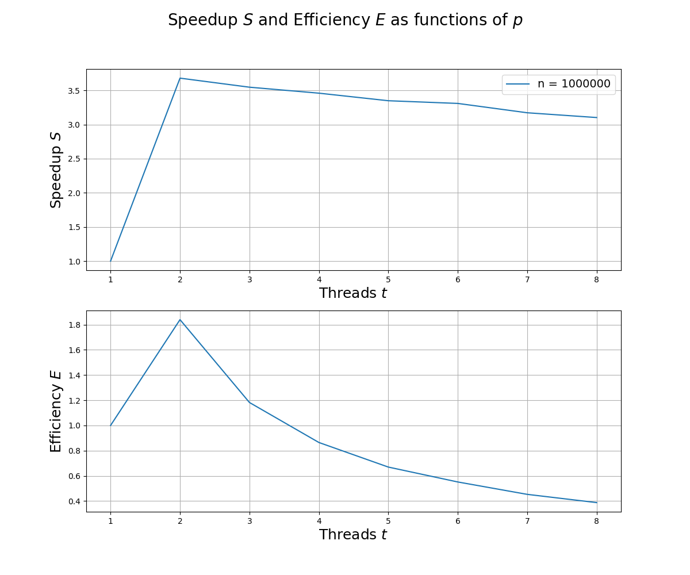

### MergeSort Algorithm

In this project we analyze parallel versions of the MergeSort algorithm using OpenMP.

Let's estimate time complexity for the sequential mergesort and for the parallel mergesort.

#### Sequential mergesort

**T(k)** = time taken to sort k elements \
**M(k)** = time taken to merge k elements

So, it can be written:
```
T(N) = 2 * T(N/2) + M(N)
```

Then, N/2 elements are further divided into two halves:
```
T(N) = 2 * [2 * T(N/4) + const * N/2] + const * N = ... =  2k * T(N/2k) + k * N * const
```

After all, we get:
```
T(N) = N * T(1) + N * log2N * constant
```

Therefore the time complexity is **O(N * logN)**.

#### Parallel mergesort

In parallel version all the steps will be the same as in the sequential algorithm, but we should notice to **p threads**.
So that the overall time complexity is **O(N/p * logN)**.

#### Test

Let's consider the graph time_execution dependence on threads and recursive_depth for mergesort.

The case with **array_size = 1000000**: 
<p align="center" width="100%">
    
</p>

The case with **array_size = 100000**: 
<p align="center" width="100%">
    
</p>

The case with **array_size = 10000**: 
<p align="center" width="100%">
    
</p>
 
Let's consider speedup and efficiency.

**Speedup = Ts / Tp**, \
where **Ts** - time of the best sequential algorithm, **Tp** - time required by parallel algorithm using **p** processors.

**Efficiency = Speedup / p**.

Here is the graph of Speedup and Efficiency for **array_size = 1000000**. 
<p align="center" width="100%">
    
</p>


#### Usage

Parameters in my case:
```
<out_filename> = array
[array_size] = 1000000 (optional)
<in_filename> = array
<sorted_filename> = sort_array
[time_data_filename] = time_data (optional)
```

First of all, generate test array:
```
python3 generateArray.py <out_filename> [array_size]
```

To compile program and prepare test data for graphs:
```
g++ -fopenmp merge_sort.c -o test -DMAKE_TEST
```

To launch:
```
./test <in_filename> <sorted_filename> [time_data_filename]
```

We will get **time_data_filename**, then compile without **-DMAKE_TEST** and launch again. After that we will get **sorted_filename**.

To validate arrays:
```
python3 validateArray.py <in_filename> <sorted_filename>
```

Before displaying the data, install necessary dependencies:
```
pip3 install numpy pandas plotly scipy matplotlib
```

To plot the graph time_execution dependence on threads and recursive_depth:
```
python3 plot.py <time_data_filename>
```

To plot the graph of Speedup and Efficiency:
```
python3 plot2D.py
```

