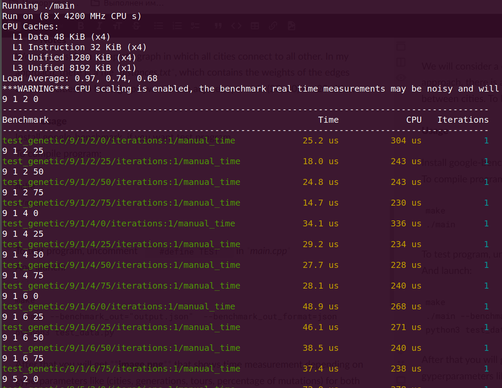
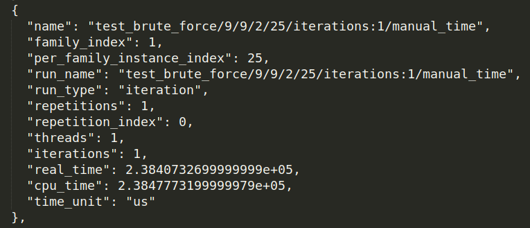
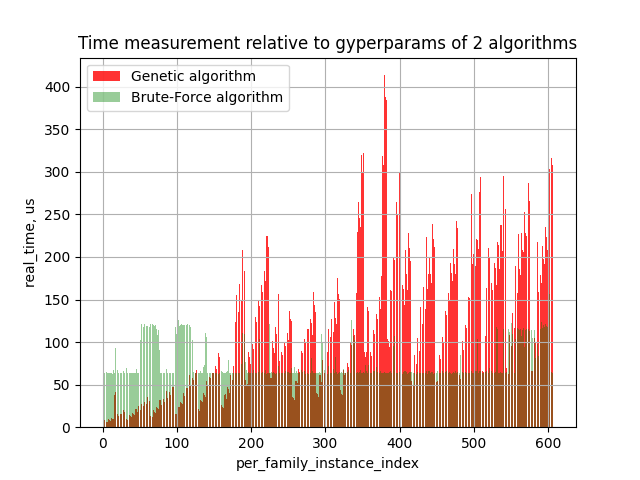
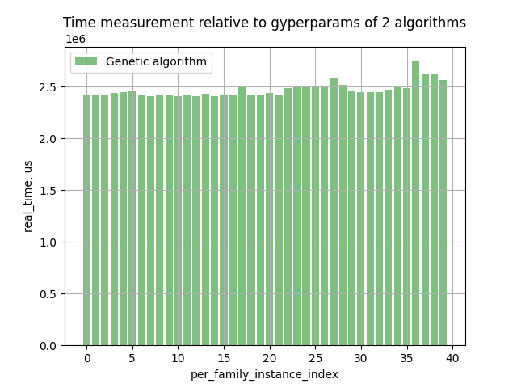
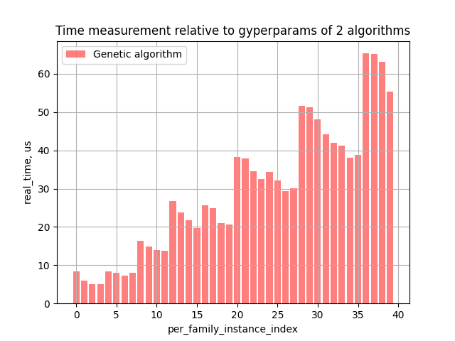

### Traveling Salesman Problem

This problem we will solve with the **Brute-Force algorithm** and the **Genetic algorithm**. 

The main idea of this problem: 
Given **n** cities with different **distances** among them and a designated first city, what is the least cost to visit all cities and return to the first one ?

#### Brute-Force algorithm
This algorithm systematically tries all possible permutations, ultimately computing the optimal answer. Runtime complexity can be estimated as **O((n-1)!/2)**. We devides by 2, because we consider for simplicity the complete graph. 

#### Genetic algorithm
The basic idea that is used to solve this problem:
1. Choose the initial population of tours, so in our case, generate a set of permutations of the orderings of the cities
2. Evaluate the cost (distance) of each individual tour
3. Repeat until termination: 
	- Select best-ranking individuals 
	- Create additional tours through crossover, mutation or both (genetic operations) and give birth to offspring
	- Add new permutations to fill out the current generation
	- Evaluate the fitness of each individual tour

For mutations we will make a minor change (randomly swap 3 cities) to make a different version of an already good order.
In our project we will use termination way as we reach a fixed number of generations.

Let's estimate the complexity of genetic algorithm in this imlementation:

Let's **n** = num of cities.

To choose the initial population of tours - **O(n * tours)**.

To evaluate the cost (distance) of each individual tour - **O(n)**

To select best-ranking individuals from each generation - **O(2 * n * tours)** ~ **O(n * tours)**

To create mutations by switching out 3 cities - **O(n * tours * percent_mutations/100)**

To add new permutations to fill out the current generation - **O(n * tours)**

To evaluate the fitness of each individual tour - **O(n * tours)**

In summary, considering cities, generations, tours and percentage of mutations we get the complexity **O(n * gen * tours)**

#### Notes
We will consider a complete graph in which all cities connect to all other. In my approach, there is a file *distances.txt*, which contains the weights of the edges between cities. To build graph we will use adjacency matrix (20x20) for 20 cities.

---

#### Usage
Install google-benchmark, if you want test program.

To compile (default) program:
```
make
make run 
make clean 	 # if necessary
```

To test program: 
``` 
make TEST=ON
make run   # it displays only in terminal 
```

To log tests and show graphics:
```
make run BENCHMARK_OUT=ON 	# you can also override BENCHMARK_OUT_FILE and BENCHMARK_OUT_FORMAT
python3 test_data.py
```

With **BENCHMARK_OUT=ON** you will save test data in file **"output.json"** .

Also you will get **image.png**, that shows time measurement depending on gyperparameters like (cities, generations, tours, percentage of mutations) for both algorithms.

#### Test

Tests with benchmarks look like this:

<p align="center" width="100%">
    
</p>

Than we get *output.json* and using *test_data.py*, according to the "family_index", read "real_time" and "per_family_instance_index".

<p align="center" width="100%">
    
</p>

Let's look at the graphic with params [cities=5, generations=(1, 20, 1), tours=(2, 10, 1 ), percentage of mutations = (0, 100, 25) ]:

<p align="center" width="100%">
    
</p>

And now let's look at other graphics with params [cities=10, generations=(1, 10, 2), tours=(2, 4, 1), percentage of mutations = (0, 100, 25) ]:

For Brute-Force algorithm:

<p align="center" width="100%">
    
</p>

For Genetic Algorithm:

<p align="center" width="100%">
    
</p>

As you can see, they differ greatly depending on cities and other params.

Also we get the comparison table for both algorithms 
```markdown
| Cities | Optimal Cost | Time Brute Force (s) | GA Cost | Time GA (s) | % of Optimal |
|:------:|:------------:|:--------------------:|:-------:|:-----------:|:------------:|
|   10   |    319,88    |        0,6816        |  419,24 |    0,4175   |      131     |
|   11   |    388,18    |        33,4417       |  607,34 |    0,5087   |      156     |
|   12   |              |                      |  691,78 |    0,7634   |              |
|   13   |              |                      |  760,52 |    0,9843   |              |
|   14   |              |                      |  858,96 |    1,1855   |              |
```
